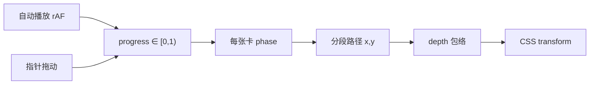
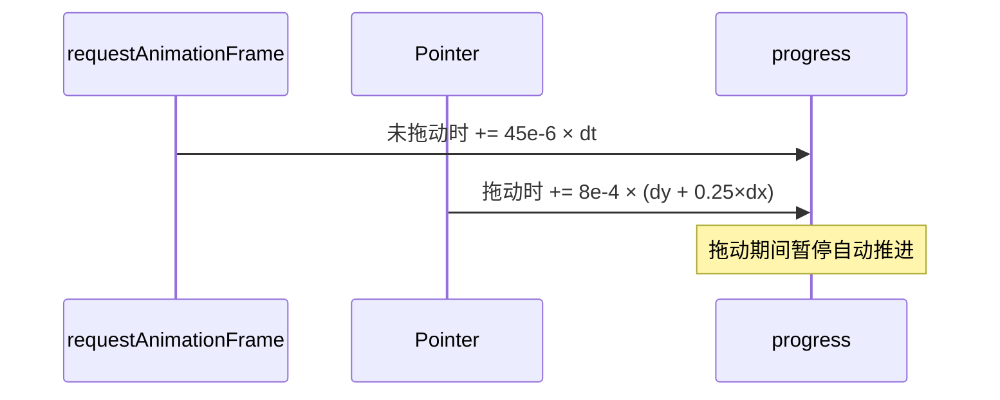
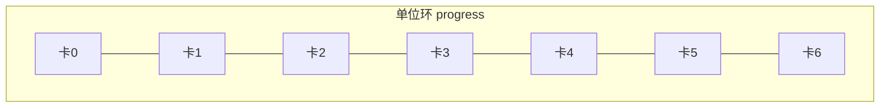
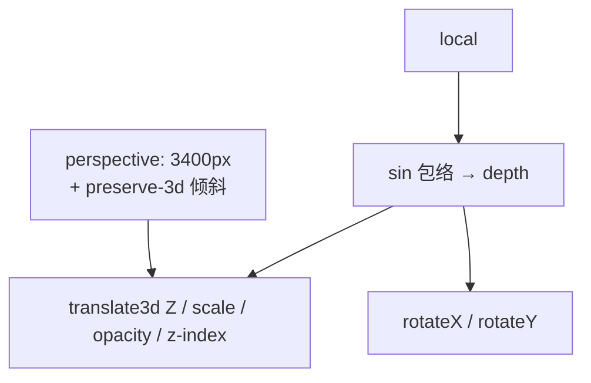

# 动效说明（专业版）

> 大白话版见 [动效说明-大白话.md](./动效说明-大白话.md)

复刻 tasteskill.dev Hero 卡片轨迹：单一标量进度驱动参数化路径采样；指针事件是进度的调制输入，而非自由平面位移。

实现：`src/CardOrbit.tsx` / `src/path.ts`

---

## 管道总览



| 概念 | 定义 |
|------|------|
| 核心模型 | 单一标量 `progress` 驱动路径采样；拖拽为进度的二次输入 |
| 位置约束 | 恒为 `f(path(phase(progress)))`，无独立 `(dx, dy)` 位移积分 |
| 与动画库关系 | 本 Hero 不依赖 Motion/GSAP 的 drag 路径约束 |

---

## 1. 进度时钟



空闲时以固定角速度积分全局进度；交互时切换为指针位移映射的进度增量，并暂停自动积分。

- 自动：`progress = (progress + 45e-6 · Δt) mod 1`
- 拖动：`Δ = Δy + 0.25·Δx`，`progress += 8e-4 · Δ`
- `setPointerCapture` 保证指针离开元素边界后仍可持续采样

---

## 2. 相位错开



七张卡在单位环上均匀相位偏移：

```ts
phase = (i / 7 + progress) % 1
```

可见性由窗口函数门控：`phase ∈ (0, 0.72)`。窗口内归一化为路径参数：

```ts
local = phase / 0.72   // ∈ [0, 1]
```

---

## 3. 分段路径

路径弧长权重：上升 `280` · 四分之一圆弧 `(π/2)·90` · 退出 `240`。


```text
  上升 (x≈-10)          圆弧 (cos/sin)           退出 (y≈70)
        │                      ╭──╮                   ──→
        │                   ╭──╯  │
        ▼                   │     │
        ●───────────────────●─────●───────────────────●
```

| 段 | 参数化 |
|----|--------|
| 上升 | 固定 `x=-10` 的线性插值，权重 `280` |
| 圆弧 | 极角 180°→270° 的四分之一圆：`x = 80 + 90·cos(θ)`，`y = -20 - 90·sin(θ)` |
| 退出 | 固定 `y=70` 的线性水平位移，权重 `240` |

设 `F = 280 / pathLen`，`G = (280 + arc) / pathLen`，则 `local < F` / `< G` / 其余分别落入三段。

---

## 4. 景深与投影



沿路径参数施加正弦包络得到标量 `depth`，再线性映射到透视 Z、缩放、透明度与堆叠序。舞台外层 `perspective: 3400px`，内层 `preserve-3d` 施加固定视点倾斜（约 `rotateX(3deg) rotateY(-4deg)`）。

```ts
translate3d(
  calc(-50% + ${x}%),
  calc(-50% + ${y}%),
  ${-1000 + 1280 * depth}px
)
rotateX(${4 - 2 * depth}deg)
rotateY(${-3 + 6 * local}deg)
scale(${0.44 + 0.74 * depth})
```

---

## 边界说明

| 非目标 | 实际做法 |
|--------|----------|
| Motion/GSAP `drag` + 路径约束 | 手写 rAF + 分段函数 |
| 每卡独立物理拖拽 | 共享 `progress`；位置为路径求值 |

**一句话：** 参数化路径上的进度驱动动画；指针事件是进度的调制输入。
