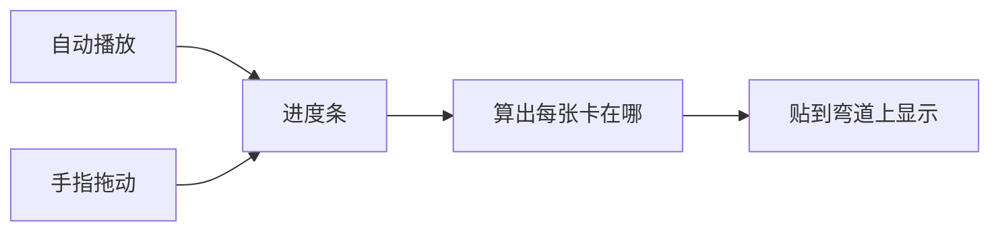
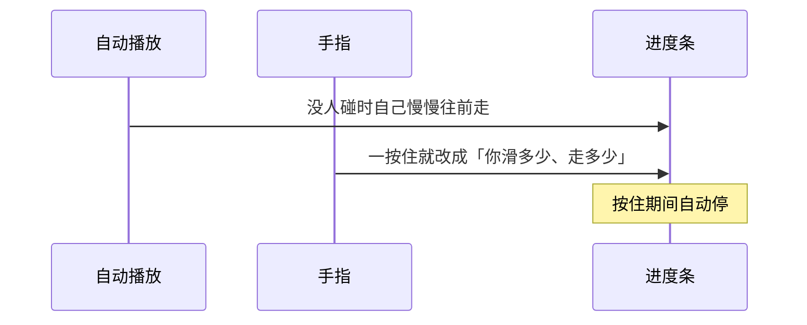

# 动效说明（大白话版）

> 专业版见 [动效说明-专业.md](./动效说明-专业.md)

这页用尽量直白的话讲清楚：卡片为什么会「贴着弯道飞」，拖的时候又为什么拖不飞出去。

代码在：`src/react/CardOrbit.tsx`（路径数学见 `src/core/path.ts`，动画驱动见 `src/core/createOrbit.ts`）

---

## 一句话先记住

你以为在拖卡片，其实是在拧一条**共用的进度条**。轨道是画死的，卡片只能顺着轨道走。



---

## 1. 进度条怎么转



- 没碰屏幕：像传送带，匀速往前转。
- 手按住：传送带停，改成跟你的滑动走。
- 主要看**上下滑**，左右滑也算一点。
- 松手：传送带继续转。

所以拖动不会把卡拽到轨道外面——你改的只是「动画播到哪一帧」。

---

## 2. 七张卡怎么接力

七张卡共用同一圈赛道，但起步点错开：

```text
卡0 ── 卡1 ── 卡2 ── 卡3 ── 卡4 ── 卡5 ── 卡6
（大家隔开 1/7 圈，像接力）
```

- 只有跑进「前大约 72%」那一段的才看得见。
- 跑到后面那截就隐身，等下一圈再出来。
- 所以你会感觉卡一张接一张冒出来，而不是七张挤在同一点。

---

## 3. 轨道长什么样

像滑滑梯拐弯再冲出去：

**交互演示：**

- 静态页：[轨道演示.html](./轨道演示.html)
- 在线 3D（R3F + KaTeX）：Demo 站点 `#/path`（例如本地 `http://localhost:5173/#/path`）

```text
  ① 上升                  ② 拐弯                   ③ 退出
        │                      ╭──╮                   ──→
        │                   ╭──╯  │
        ▼                   │     │
        ●───────────────────●─────●───────────────────●
      从底下冒上来         甩个弯                 往右滑走消失
```


| 段 | 人眼看到的 |
|----|------------|
| 上升 | 从下面竖直冒出来 |
| 圆弧 | 拐个弯（就是用 cos/sin 画出来的那段） |
| 退出 | 弯完后平着往右滑走、变淡 |

---

## 4. 为什么有的大有的小

卡在轨道**中间**时：又大又清楚，叠在最上面。  
刚出来或快走时：又小又淡。

外层加了一点「摄像机透视」，整组再稍微歪一点，看起来更立体——但本质还是 2D 网页上的 CSS 变换，不是真 3D 引擎。

---

## 容易误会的点

| 以为是 | 其实是 |
|--------|--------|
| 用动画库把卡「吸」在路径上拖 | 自己写循环拧进度，再按公式算位置 |
| 每张卡可以被随便拽来拽去 | 只有一条进度条；卡的位置永远是「进度 → 轨道上的点」 |

**再记一遍：** 轨道固定，拧的是时间轴，不是随便拽卡片。
